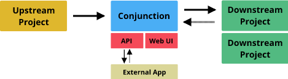

# Conjunction

Connecting CI pipelines together so that upstream projects can trigger builds and track results for downstream projects

## Why is this needed?

- **Oblivious dependencies** - An upstream project changes, but how do downstream projects know it has changed?
- **Breaking changes** - Downstream projects are failing because of an upstream change but the upstream project is oblivious
- **Restricted webhooks** - Webhooks for GitHub require the user to be logged in and part of the project
- **Unknown maintainers** - Something goes wrong downstream but it is not clear who to contact upstream about it
- **Unclear users** - It is hard to tell upstream what downstream projects are using your artifacts

## How does it work at high level?

Conjunction is pretty simple.

1. **Upstream build reports success** - Upon successful pipeline completion, an upstream project sends its status to Conjunction.
2. **Conjunction notifies dependencies** - Conjunction sends a notification to each project that is depending on the upstream project.
3. **Dependencies report back status** - When a dependent project's build has finished, it reports back to Conjunction its status.

## What do the data structures look like?

### A trigger event looks like:

- A build event ID
- A token used for authentication with the CI system
- A project ID
- Build metadata (TBD)
  - Owners file
  - Git Repository URL
  - Conjunction Project URL
  - Branch / Tag / Commit hash
  - Artifacts list

### A status event looks like:

- A build event ID
- A token used for authentication with Conjunction
- A project ID
- Build metadata (TBD)
  - Owners file
  - Git Repository URL
  - Branch / Tag / Commit hash
  - Artifacts list
- Build result

## How will it work with existing CI systems?

- Trigger events use webhooks in the target CI system that starts a build pipeline. Usually these webhooks require a token for authentication and allow you to pass metadata in as variables.
  - On Jenkins, use [Generic Webhook Trigger plugin](https://wiki.jenkins.io/display/JENKINS/Generic+Webhook+Trigger+Plugin)
  - On Gitlab, use [Triggers](https://docs.gitlab.com/ee/ci/triggers/#adding-a-new-trigger)
  - On Travis, use [Triggers](https://docs.travis-ci.com/user/triggering-builds/)
  - On Zuul, TBD
- Status events sent to Conjunction use sections of the pipeline config to run callbacks from.
  - On Jenkins, use [Post section](https://github.com/jenkinsci/pipeline-model-definition-plugin/wiki/Running-multiple-steps#cleaning-up-after-yourself)
  - On Gitlab, use [When section](https://docs.gitlab.com/ee/ci/yaml/#when)
  - On Travis, use [the info here](https://docs.travis-ci.com/user/customizing-the-build)
  - On Zuul, TBD

## What are the advantages of this approach?

### Simple
- Just one server. Simple messaging system.

### Integrates across existing build systems easily
- Use webhooks / triggers and existing build configs to integrate with the system.

## What other features could be implemented?

### Badges
- For including into README files and websites.
- Indicate percentage of downstream that succeeded last build.
- Statistics showing how many improved / broke / stayed the same compared to the build before.
- [Shields.io](https://shields.io/) support

### Auxilliary notifications
- IRC, Slack, Twitter, custom system

### Hierarchical builds
- Project A triggers dependent project B. Project B completes and then triggers project C.
- Map the whole build tree from starting project to the last project.
- Check for repeated nodes in the build tree to stop build loops.

### Event auditing
- Why did this event happen? / Where did it come from?
- Trace the source of the event back to its origin

### Build changes between events
- What has changed between the last successful run and the current failure?
- What did we change to get the failure to succeed?
- References to source code diffs

### Build time statistics
- Estimate build time from previous successful builds
- Keep track of how long build time is taking
