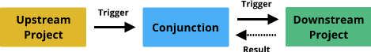

# Conjunction

Connecting CI pipelines together so that upstream projects can trigger builds and track results for downstream projects

## Why is this needed?

- An upstream project changes - how do downstream projects know it has changed?
- Downstream projects are failing because of an upstream change but the upstream project is oblivious
- Webhooks for GitHub require the user to be logged in and part of the project
- Something goes wrong downstream but it is not clear who to contact upstream
- It is hard to tell upstream what downstream projects are using your artifacts

## How does it work at high level

Conjunction is pretty simple.

1) Upon successful pipeline completion, an upstream project sends its status to Conjunction.
2) Conjunction sends a notification to each project that is depending on the upstream project.
3) When a dependent project's build has finished, it reports back to Conjunction its status.

## What do the data structures look like

### A trigger event looks like:

- A build event ID
- A token used for authentication with the CI system
- A project ID
- Build metadata

### A status event looks like:

- A build event ID
- A project ID
- A token used for authentication with Conjunction
- Build metadata (TBD)
- Build result

## Why this approach

### 1) Simple
- Just one server, simple messaging system

### 2) Integrates across existing build systems easily
- Use webhooks / triggers and existing build configs to integrate with the system

